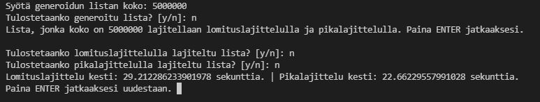

# Algorithm comparison

A program to roughly compare different sorting algorithms. The program generates random lists for the given sorting algorithms and then lets the algorithms sort them. The program measures the time taken to sort the lists in order.  

## Why?  

As I was studying and researching algorithms, I came across quicksort and mergesort sorting algorithms. I wanted to know which one was better for sorting and of course went to the most trusted source of information: The internet. It turned out that many of the sites I was looking into had outright contradictory information regarding regarding which had a better sorting performance in which conditions.  

So I created the 'Algorithm comparison' to see which one truly had the better performance. There are several caveats when trying to compare the performance of sorting algorithms. You need to take into consideration the type of data you are trying to compare, additional storage space requirements, whether the data will be inplace etc... In this case I only wanted to know which sorting algorithm could sort a random list of arbitary size into a sorted list.  

## How  

Running Algorithm comparison is easy. Just run 'algoritmit.py' and follow the prompts. The program will ask the size of the randomized list and then whether you wish the lists be printed on screen.  

  

NOTE! Depending on the hardware of your machine, sorting and printing large lists can take a long time.  

## Algorithms implemented:  

* Quicksort  
* Mergesort  
